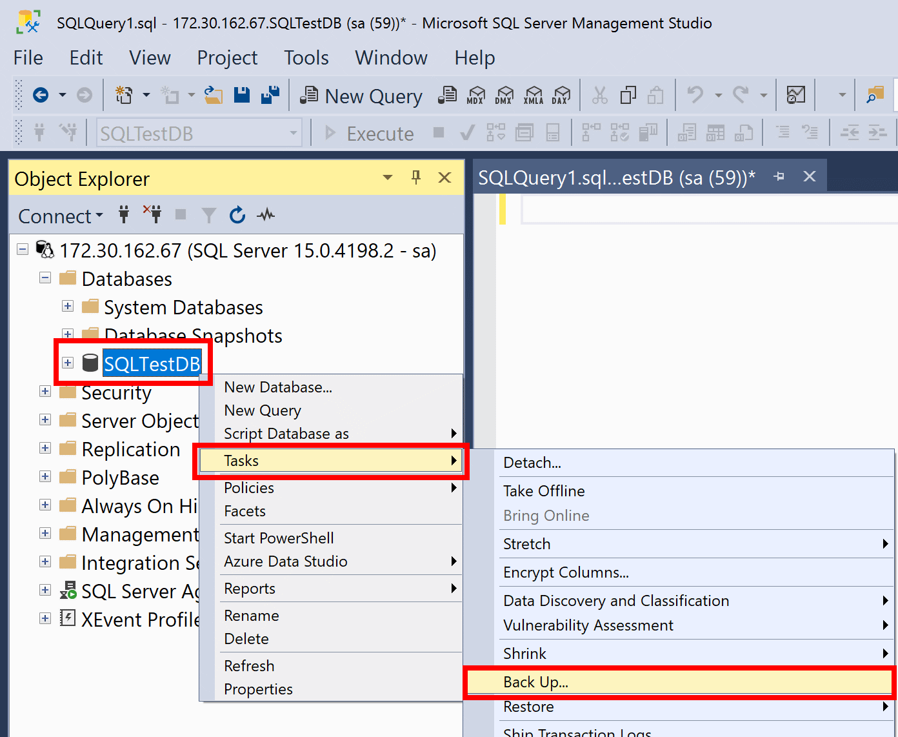

## Creación de una base de datos de prueba


> 1.  Inicie SQL Server Management Studio (SSMS) y conéctese a la instancia de SQL Server.

> 2. Abra una ventana de nueva consulta.

> 3. Ejecute el siguiente código Transact-SQL (T-SQL) para crear la base de datos de prueba.


```sql
USE [master];
GO

CREATE DATABASE [SQLTestDB];
GO

USE [SQLTestDB];
GO
CREATE TABLE SQLTest (
	ID INT NOT NULL PRIMARY KEY,
	c1 VARCHAR(100) NOT NULL,
	dt1 DATETIME NOT NULL DEFAULT GETDATE()
);
GO

USE [SQLTestDB]
GO

INSERT INTO SQLTest (ID, c1) VALUES (1, 'test1');
INSERT INTO SQLTest (ID, c1) VALUES (2, 'test2');
INSERT INTO SQLTest (ID, c1) VALUES (3, 'test3');
INSERT INTO SQLTest (ID, c1) VALUES (4, 'test4');
INSERT INTO SQLTest (ID, c1) VALUES (5, 'test5');
GO

SELECT * FROM SQLTest;
GO 
```


> 4. Actualice el nodo Bases de datos en el Explorador de objetos para ver la nueva base de datos.


# Realizar una copia de seguridad

> 1. Para realizar una copia de seguridad de la base de datos, siga estos pasos:

> 2. Inicie **SQL Server Management Studio (SSMS)** y conéctese a la instancia de SQL Server.

> 3. Expanda el nodo **Bases de datos** del Explorador de objetos.

> 4. Haga clic con el botón derecho en la base de datos, mantenga el puntero sobre **Tareas** y seleccione Hacer **copia de seguridad**…

> 5. En **Destino**, confirme que la ruta de acceso de la copia de seguridad es correcta. Si necesita cambiarla, seleccione **Quitar** para quitar la ruta de acceso existente y, luego, **Agregar** para escribir una nueva ruta de acceso. Puede usar el botón de puntos suspensivos para desplazarse a un archivo específico.

> 6. Seleccione **Aceptar** para realizar una copia de seguridad de la base de datos.




También puede ejecutar el comando de ***Transact-SQL*** siguiente para hacer copias de seguridad de la base de datos. La ruta de acceso puede ser distinta en su equipo:


```sql
USE [master];
GO
BACKUP DATABASE [SQLTestDB]
TO DISK = N'C:\Program Files\Microsoft SQL Server\MSSQL14.MSSQLSERVER\MSSQL\Backup\SQLTestDB.bak' 
WITH NOFORMAT, NOINIT,
NAME = N'SQLTestDB-Full Database Backup', SKIP, NOREWIND, NOUNLOAD, STATS = 10;
GO
````


# Inicio rápido: Copia de seguridad y restauración de SQL en Azure Blob Storage
 

> https://learn.microsoft.com/es-es/sql/relational-databases/tutorial-sql-server-backup-and-restore-to-azure-blob-storage-service?view=sql-server-ver16&tabs=SSMS


> https://www.youtube.com/watch?v=i3SI93F1jbI

# Cómo restaurar la base de datos de SQL Server desde Azure Storage usando URL

> https://www.youtube.com/watch?v=FlaPFl8WGq8        


# Creacion  Authentication con Azure Active Directory 


[]( https://www.youtube.com/watch?v=FkmIFYWNYVM "Link Title")


<iframe width="560" height="315" src="https://www.youtube.com/embed/IwpmLUpvTBA" title="YouTube video player" frameborder="0" allow="accelerometer; autoplay; clipboard-write; encrypted-media; gyroscope; picture-in-picture; web-share" allowfullscreen></iframe> 


#  Añadir usuario en SQL Server – Nuevo inicio de sesión


https://parzibyte.me/blog/2019/06/03/anadir-usuario-sql-server-nuevo-inicio-sesion/


